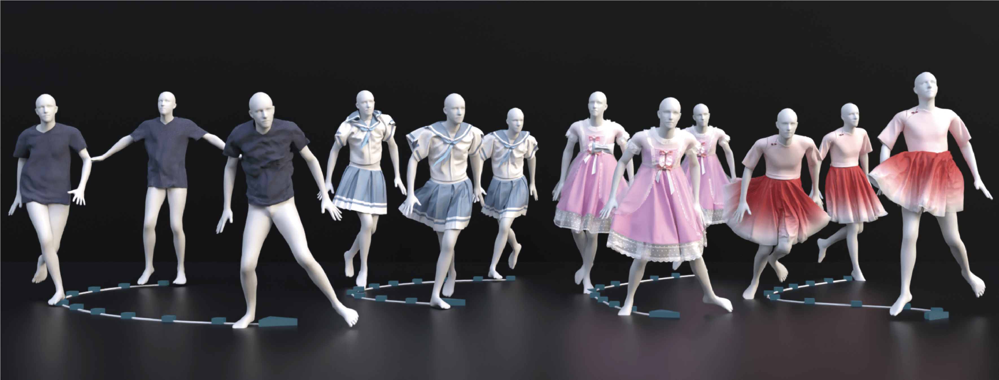

<h1 align="center">UNIC: Neural Garment Deformation Field<br>for Real-time Clothed Character Animation</h1>

<p align="center">
  <a href="https://afterjourney00.github.io/" target="_blank">Chengfeng Zhao</a><sup>1</sup>,
  <a href="https://github.com/jumbo-q" target="_blank">Junbo Qi</a><sup>2</sup>,
  <a href="https://frank-zy-dou.github.io/" target="_blank">Zhiyang Dou</a><sup>3</sup>,
  <a href="https://www.cs.cmu.edu/~minchenl/" target="_blank">Minchen Li</a><sup>4</sup>,
  <a href="https://liuziwei7.github.io/" target="_blank">Ziwei Liu</a><sup>5</sup>,
  <a href="https://engineering.tamu.edu/cse/profiles/Wang-Wenping.html" target="_blank">Wenping Wang</a><sup>6</sup>,
  <a href="https://liuyuan-pal.github.io/" target="_blank">Yuan Liu</a><sup>1,5,&dagger;</sup>
</p>
<p align="center">
  <sup>1</sup>The Hong Kong University of Science and Technology &nbsp;&nbsp;
  <sup>2</sup>Waseda University &nbsp;&nbsp;
  <sup>3</sup>The University of Hong Kong &nbsp;&nbsp;
  <br>
  <sup>4</sup>Carnegie Mellon University &nbsp;&nbsp;
  <sup>5</sup>Nanyang Technological University &nbsp;&nbsp;
  <sup>6</sup>Texas A&M University
  <br>
  <i><sup>&dagger;</sup>Corresponding author</i>
</p>
<p align="center">
  <a href="https://github.com/IGL-HKUST/UNIC"></a>
  <a href='https://github.com/IGL-HKUST/UNIC'></a>
</p>

<div align="center">
  
</div>

## 🚀 Getting Started

### 1. Environment Setup

We tested our environment on `Ubuntu 20.04 LTS` with `CUDA 12.1`, `gcc 9.4.0`, and `g++ 9.4.0`.

```bash
conda create python=3.10 --name unic
conda activate unic

pip install torch==2.5.0 torchvision==0.20.0 torchaudio==2.5.0 --index-url https://download.pytorch.org/whl/cu121
pip install -r requirements.txt

conda install -c fvcore -c iopath -c conda-forge fvcore iopath
pip install "git+https://github.com/facebookresearch/pytorch3d.git@stable"

git clone https://github.com/unlimblue/KNN_CUDA.git
cd KNN_CUDA
make && make install
cd ..
```

<!-- ### 2. Run Demo

```bash
python -m test --cfg configs/config_train_unic_jk.yaml
```

## 🔬 Training

### 1. Data Preparation

Overall, the data structure should be constructed like this:
```
<your_data_root>/unity_smpl/
|-- hanfu_dress
|   |-- sequence_*
|   |   |-- deformation
|   |   |   `-- s_*.obj
|   |   |-- motion
|   |   |   `-- s_*.obj
|   |   `-- animation.fbx
|-- jk_dress
|   |-- sequence_*
|   |   |-- deformation
|   |   |   `-- s_*.obj
|   |   |-- motion
|   |   |   `-- s_*.obj
|   |   `-- animation.fbx
|-- princess_dress
|   |-- sequence_*
|   |   |-- deformation
|   |   |   `-- s_*.obj
|   |   |-- motion
|   |   |   `-- s_*.obj
|   |   `-- animation.fbx
|-- tshirt
|   |-- sequence_*
|   |   |-- deformation
|   |   |   `-- s_*.obj
|   |   |-- motion
|   |   |   `-- s_*.obj
|   |   `-- animation.fbx
```

### 2. Data Pre-processing

First, install FBX Python SDK:

```bash
wget https://damassets.autodesk.net/content/dam/autodesk/www/files/fbx202037_fbxpythonsdk_linux.tar.gz
tar -xzf fbx202037_fbxpythonsdk_linux.tar.gz --no-same-owner

mkdir <your_path_for_fbx>
chmod 777 fbx202037_fbxpythonsdk_linux
./fbx202037_fbxpythonsdk_linux <your_path_for_fbx>

cd <your_path_for_fbx>
conda activate unic
python -m pip install fbx-2020.3.7-cp310-cp310-manylinux1_x86_64.whl
```
> [!TIP]
> If you encounter the error `libc.so.6: version GLIBC_2.28 not found` when `import fbx`, try to add `deb http://security.debian.org/debian-security buster/updates main` in your `/etc/apt/sources.list`. Then, run the following commands:
> ```bash
> sudo apt update
> 
> # if NO_PUBKEY error occurs, run the commented command:
> # sudo apt-key adv --keyserver keyserver.ubuntu.com --recv-keys 112695A0E562B32A 54404762BBB6E853
> # sudo apt update
> 
> sudo apt list --upgradable
> sudo apt install libc6-dev libc6
> ```

Second, run the pre-processing code:
```
python -m data.preprocess.unic
```
The pre-processed data will be saved in `<your_data_path>/pre_processed/` folder.

### 3. Train UNIC

> [!NOTE]
> We tested our training code on NVIDIA RTX 3090 and NVIDIA RTX 2080Ti GPUs.  
> Set `USE_DDP = False` in `train.py` to disable DDP (Distributed Data Parrallel) while training if you need.

As an example, run the following command to train a deformation field for jk dress:
```bash
python -m train --cfg configs/unic_jk_dress.yaml --nodebug
```
Checkpoints will be saved in `checkpoints/` folder. In our experiment, we choose `epoch300.pth` for all the comparisons, evaluations and presentations.

## 🏄‍♂️ Contributors

- Chengfeng Zhao - [AfterJourney00](https://github.com/AfterJourney00)
- Junbo Qi - [jumbo-q](https://github.com/jumbo-q)

## 📖 Citation
If you find our code or paper helps, please consider citing:
```bibtex
@article{zhao2025unic,
  title   = {UNIC: Neural Garment Deformation Field for Real-time Clothed Character Animation},
  author  = {Zhao, Chengfeng and Qi, Junbo and Dou, Zhiyang and Li, Minchen and Liu, Yuan},
  journal = {arXiv preprint arXiv:},
  year    = {2025}
}
``` -->

## Acknowledgments

Thanks to the following work that we refer to and benefit from:
- [Codebook Matching](https://github.com/sebastianstarke/AI4Animation/tree/master/AI4Animation/SIGGRAPH_2024): the categorical encoder architecture and the Unity project framework;
- [NeRF-Pytorch](https://github.com/yenchenlin/nerf-pytorch): the neural field implementation;
- [SMPL-to-FBX](https://github.com/softcat477/SMPL-to-FBX): the FBX Python SDK usage;
- [HOOD](https://github.com/dolorousrtur/hood): the visualization code

## Licenses

<a rel="license" href="http://creativecommons.org/licenses/by-nc-sa/4.0/"></a><br />This work is licensed under a <a rel="license" href="http://creativecommons.org/licenses/by-nc-sa/4.0/">Creative Commons Attribution-NonCommercial-ShareAlike 4.0 International License</a>.
